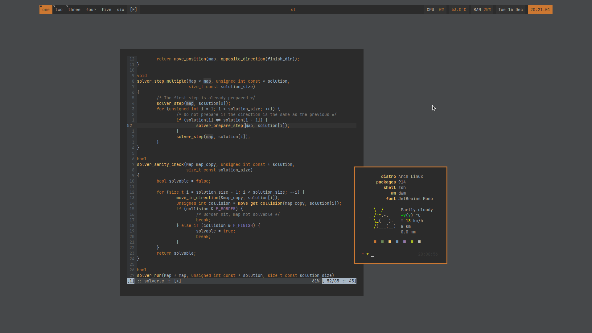

# dotfiles
Collection of all my configuration files, managed using GNU stow.



## info
| distro|<span style="font-weight:normal">Arch Linux</span>| 
|---:|:---|
| **shell**| zsh |
| **terminal**| st |
| **wm**| dwm |
| **launcher**| dmenu |
| **editor**| neovim |
| **browser**| Firefox |
| **font**| JetBrains Mono |
| **colors**| darcula |

## install
`git clone --recurse-submodules https://github.com/FlyingBBQ/dotfiles ~/.dotfiles`

## manage
Get [GNU stow](https://www.gnu.org/software/stow/)

`sudo pacman -S stow` or `sudo apt install stow`

Then:
```bash
cd ~/.dotfiles
# the contents (dotfiles) of these directories are symlinked to ~/
stow xorg zsh

cd ~/.dotfiles/config
# create symlinks in the target directory ~/.config
stow -t ~/.config dunst nvim ranger
```

To remove:
```bash
cd ~/.dotfiles
stow -D zsh

cd ~/.dotfiles/config
stow -t ~/.config -D ranger
```

Note: you can use an alias like `stowc='stow -t ~/.config'` to manage `~/.dotfiles/config`

## suckless good
I use some [suckless](https://suckless.org/) software which I forked and added as a submodules to this repository.
The forked repositories come with some added patches which I personally like.
Dependencies for building this software are `make` and a C compiler.

```bash
cd ~/.dotfiles/suckless/dwm
make
```
This will create a `config.h` which you can modify to your liking.
Install with: `sudo make clean install`.

Or you can switch to a branch which already contains a `config.h`

## startup
If you use my xorg configuration there will be a `.xinitrc` which starts `dwm` when you run `startx`.
This `.xinitrc` also looks for a file `~/.startup_local`, which is executed when found.
Use this script to auto start any programs you like, for example:

```bash
#!/usr/bin/env bash

xsetroot -solid '#504945'

dunst &
redshift &
. ~/.dotfiles/suckless/dwmstatus.sh -c -t -m -d -h &
```

## neovim
My nvim configuration is a separate repository added as submodule.
It is not compatible anymore with vim since it is (partly) written in lua.

## power tools
Some tools I like:

1. [`nvim`](https://neovim.io/)
1. [`fzf`](https://github.com/junegunn/fzf)
1. [`rg`](https://github.com/BurntSushi/ripgrep)
1. [`fd`](https://github.com/sharkdp/fd)
1. [`bat`](https://github.com/sharkdp/bat)
1. [`exa`](https://github.com/ogham/exa)
1. [`thefuck`](https://github.com/nvbn/thefuck)
